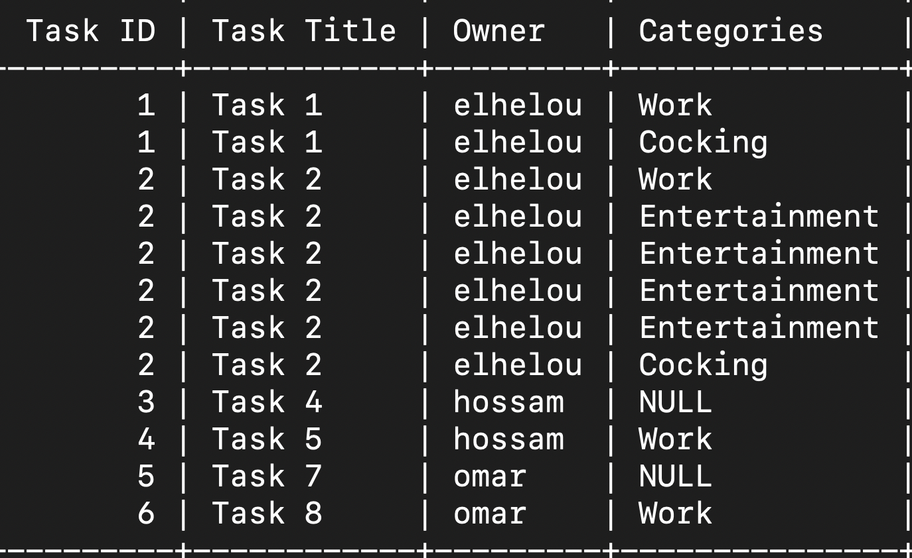
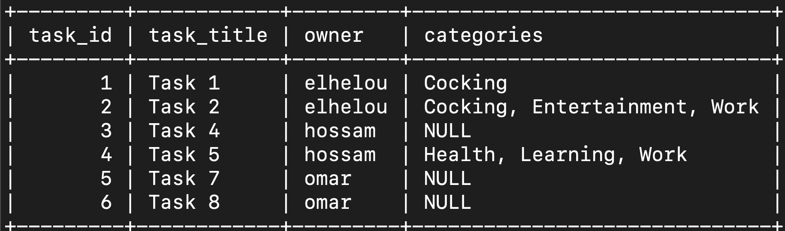

# Documentation

## Todos
- Create a middleware
- Get all users tasks (Admin user)
    - Update database (Migration file)

## SQLs

```sql
-- Dumping users table
INSERT INTO users (name, email, password)
VALUES
('elhelou', 'elhelou@gmail.com', '123456'),
('hossam', 'hossam@gmail.com', '123456'),
('omar', 'omar@gmail.com', '123456');

-- Dumping tasks table
INSERT INTO tasks (title, description, priority, user_id)
VALUES
('Task 1', null, 1, 1),
('Task 2', null, 2, 1),
('Task 4', null, 4, 2),
('Task 5', null, 5, 2),
('Task 7', null, 2, 3),
('Task 8', null, 1, 3);

-- Dumping categories table
INSERT INTO categories (name)
values
('Work'),
('Learning'),
('Entertainment'),
('Health'),
('Cocking');

-- Dumping category_task table
INSERT INTO category_task(task_id, category_id)
VALUES(1, 3),
(1, 4),
(1, 5),
(4, 2),
(3, 1),
(3, 3),
(3, 5);
```

## Reports (SQLs)

### 1. List All Tasks With All Categories and All Users (Not organized statement)

```sql
select
    tasks.id as 'Task ID',
    tasks.title as 'Task Title',
    users.name as 'Owner',
    categories.name as 'Categories'
from tasks
join users on tasks.user_id = users.id
left join category_task on tasks.id = category_task.task_id
left join categories on category_task.category_id = categories.id
order by tasks.id, categories.id;
```

#### Result



### 2. List Available Tasks With Their Owners and Link Them to Their Categories

```sql
select
    tasks.id as 'Task ID',
    tasks.title as 'Task Title',
    users.name as 'Owner',
    group_concat(categories.name order by categories.name separator ', ') as Categories
from tasks
join users on tasks.user_id = users.id
left join category_task on tasks.id = category_task.task_id
left join categories on category_task.category_id = categories.id
group by tasks.id, tasks.title, users.name;
```

#### Result


